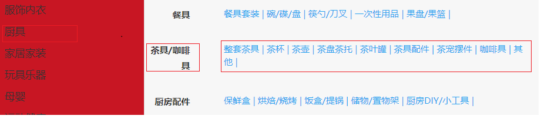
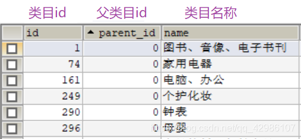
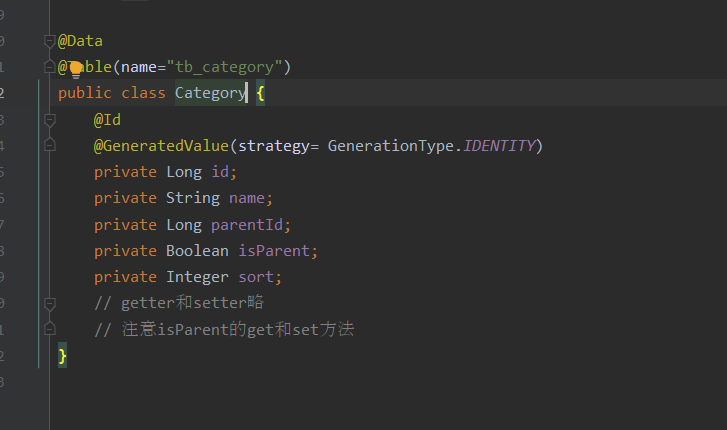
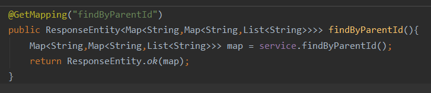

# 分类展示

## 一、需求分析

一级分类包含多个二级分类

每个二级分类包含多个三级分类



1.表关系如下: ( 自关联表 - tb_category )

parent_id:
         一级分类: 默认是 0
         二级分类: 一级分类的id
         三级分类: 二级分类的id



2.三级分类数据
    一级分类  ->  包含二级分类  ->  包含三级分类!      ( 一对多对多 )

**①自关联表 -> 自关联POJO对象!**



**②Map集合接收 -> Map<String , Map<String , List>>**



#### 二、后端实现( 分布式框架 )

Controller层

```
@GetMapping("findByParentId")
public ResponseEntity<Map<String,Map<String,List<String>>>> findByParentId(){
    Map<String,Map<String,List<String>>> map = service.findByParentId();
    return ResponseEntity.ok(map);
}
```

Service层

```
public Map<String, Map<String, List<String>>> findByParentId() {
    Map<String, Map<String, List<String>>> map = new HashMap<>();
    Category category1 = new Category();
    category1.setParentId(0l);
    List<Category> list1 = mapper.select(category1);

    //遍历第一遍分类
    list1.forEach(cate1 -> {
        //获取第一级的id
        Long oneId = cate1.getId();
        //根据第二级的 parentId=第一级的id 查询第二级分类
        Category category2 = new Category();
        category2.setParentId(oneId);
        category2.setIsParent(true);
        List<Category> list2 = mapper.select(category2);
        Map<String, List<String>> sonMap = new HashMap<>();

        //遍历第二级分类
        list2.forEach(cate2 ->{
            Long twoId = cate2.getId();
            List<String> threeList = mapper.getName(twoId,false);
            sonMap.put(cate2.getName(),threeList);
        });

        map.put(cate1.getName(),sonMap);
    });

    return map;
}
```

Mapper层

```
@Select("SELECT name FROM tb_category where parent_id = #{id} AND is_parent = #{boo}")
List<String> getName(@Param("id") Long id, @Param("boo") Boolean boo);
```

#### 三、前端实现

1.初始化加载方法

```
<script type="text/javascript">
   var indexFenlei = new Vue({
      el:"#fenlei",
      data:{
         b2c,
         cateMap:{},
         flage: true
      },
      created(){
         this.getIndexList();
      },
      methods:{
         getIndexList(){
            b2c.http.get("/item/category/findByParentId").then(resp => {
               // console.log(resp)
               this.cateMap = resp.data;
               console.log(this.cateMap)
            })
         }
      },
   });
</script>
```

2.前端遍历代码

```
<div class="yui3-u Left all-sort-list">
   <div class="all-sort-list2"  id="fenlei"  >
      <!-- v-for="(key,value) in cateMap" -->
      <div class="item bo" v-for="(key,value,i) in cateMap" v-if="i<=14">
         <h3>{{value}}</h3>
         <!--class="item-list clearfix"-->
         <div class="item-list ">
            <div class="subitem">
               <dl class="fore1" v-for="(k,v) in key">
                  <dt>{{v}}</dt>
                  <dd>
                     <a href="" v-for="c in k">{{c}} | </a>
                  </dd>
               </dl>
            </div>
         </div>
      </div>
   </div>
```

3.加入style

```   
<style>
   .item:hover .item-list{
      display: table;
   }
</style>
```


# 轮播图

## 1.0.前言

因为完善项目,需要添加轮播管理,前端留好的图片地址和跳转链接地址复制进去就可以,但是去公司不能这样,所以就写了一套轮播图管理的增删改查

## 1.1.数据库

只要有 id 图片地址 跳转链接地址就可以

直接数据库建表

```
CREATE TABLE `tb_lunbo` (
	`id` BIGINT NOT NULL AUTO_INCREMENT COMMENT '轮播图id',
	`tupian` VARCHAR ( 255 ) DEFAULT NULL COMMENT '轮播图片地址',
	`tiaozhuan` VARCHAR ( 255 ) DEFAULT NULL COMMENT '跳转链接',
PRIMARY KEY ( `id` ) USING BTREE 
) ENGINE = INNODB AUTO_INCREMENT = 9 DEFAULT CHARSET = utf8;
```

## 1.2.后端

后端代码无非就是 controller service mapper entity这四个层

这些东西都是在item下实现的

item-interface下Lunbo

```
import lombok.Data;

import javax.persistence.GeneratedValue;
import javax.persistence.GenerationType;
import javax.persistence.Id;
import javax.persistence.Table;

@Data
@Table(name = "tb_lunbo")
public class LunBo {

    @Id
    @GeneratedValue(strategy = GenerationType.IDENTITY)
    private Integer id;
    private String tupian;
    private String tiaozhuan;


}
```

item-service中controller

```
import com.mr.espojo.LunBo;
import com.mr.service.LunBoService;
import org.springframework.beans.factory.annotation.Autowired;
import org.springframework.http.HttpStatus;
import org.springframework.http.ResponseEntity;
import org.springframework.web.bind.annotation.*;

import java.util.List;

@RestController
@RequestMapping("lunbo")
public class LunBoController {

    @Autowired
    private LunBoService lunBoService;

    //查询
    @GetMapping("query")
    public ResponseEntity<List<LunBo>> query(){
        return ResponseEntity.ok(lunBoService.query());
    }


    //新增
    @PostMapping("save")
    public ResponseEntity<Void> save(LunBo lunBo){
        lunBoService.saveOrUpdate(lunBo);
        return new ResponseEntity<>(HttpStatus.OK);
    }

    //修改
    @PutMapping("update")
    public ResponseEntity<Void> update(LunBo lunBo){
        lunBoService.saveOrUpdate(lunBo);
        return new ResponseEntity<>(HttpStatus.OK);
    }

    //查询id
    @GetMapping("querylunboid/{id}")
    public ResponseEntity<LunBo> findById(@PathVariable("id") Long id){
        LunBo lunBo= lunBoService.findById(id);
        return  ResponseEntity.ok(lunBo);
    }

    //删除
    @DeleteMapping("delete")
    public void delete(@RequestParam("id") Long id){
        lunBoService.delete(id);
    }

}
```

在item-service下建service

```
import com.mr.mapper.LunBoMapper;
import com.mr.espojo.LunBo;
import org.springframework.stereotype.Service;

import javax.annotation.Resource;
import java.util.List;

@Service
public class LunBoService {

    @Resource
    private LunBoMapper lunBoMapper;

    //查询
    public List<LunBo> query(){
        return lunBoMapper.selectAll();
    }
    //新增和修改
    public void saveOrUpdate(LunBo lunBo){
        if (null != lunBo){
            //修改
            if ( null != lunBo.getId() &&lunBo.getId() != 0 ){
                lunBoMapper.updateByPrimaryKey(lunBo);
            }else {
                lunBoMapper.insert(lunBo);
            }
        }
    }

    //根据id查询
    public LunBo findById(Long id){
        return lunBoMapper.selectByPrimaryKey(id);
    }

    //删除
    public void delete(Long id){
        if (null != id && id != 0){
            lunBoMapper.deleteByPrimaryKey(id);
        }
    }

}
```

在item-service下建mapper

```
import com.mr.espojo.LunBo;
import org.apache.ibatis.annotations.Mapper;


@Mapper
public interface LunBoMapper extends tk.mybatis.mapper.common.Mapper<LunBo>{
}
```

## 1.3.前端

前端比较麻烦有两个模块需要修改,一个是后台管理中需要新建一个模块负责增删改查,一个是在客户使用的商城主页中循环展示出来

首先是manage.b2c.com后台管理的


```
route("/item/Lunbo",'/item/Lunbo',"Lunbo")
```


```
{ title: "规格参数", path: "/specification" }
```

之后在item下面建轮播的vue和form

Lunbo.vue

```
<template>
  <v-card>
    <v-card-title>
      <v-btn @click="showAddLunBo" color="primary">新增轮播图</v-btn>
      <v-spacer/>
      <v-text-field
        v-model="search"
        append-icon="search"
        label="搜索轮播id"
        single-line
        hide-details
      />
    </v-card-title>
    <!--:的意思是 v-bind : 可以使用vue的属性-->
    <v-data-table
      :headers="headers"
      :items="desserts"

      :pagination.sync="options"
      :total-items="totalDesserts"
      :loading="loading"
      class="elevation-1"
    >
      <!--循环体代码-->
      <template slot="items" slot-scope="props">
        <td class="text-xs-center">{{ props.item.id }}</td>
        <td class="text-xs-center">{{ props.item.tupian}}</td>
        <td class="text-xs-center">{{ props.item.tiaozhuan }}</td>
        <!--        <td class="text-xs-center"></td>-->
        <!--        <td class="text-xs-center">{{ props.item.letter }}</td>-->
        <td class="justify-center layout px-0">
          <v-btn icon @click="editLunBo(props.item)">
            <i class="el-icon-edit"/>
          </v-btn>
          <v-btn icon @click="deleteLunBo(props.item)">
            <i class="el-icon-delete"/>
          </v-btn>
        </td>
      </template>
    </v-data-table>
    <!--弹出框-->
    <v-dialog
      persistent
      scrollable
      v-model="dialog"
      max-width="550"
    >
      <!--内容主要 form表单 保存按钮 标题-->
      <v-card>
        <v-toolbar dense dark color="primary">
          <v-card-title>
            轮播图{{isEdit?"修改":"新增"}}
          </v-card-title>
          <!--          使用图表优化 icon-->
          <v-spacer></v-spacer>
          <v-btn @click="closeLunBo" icon>
            <v-icon>close</v-icon>
          </v-btn>
        </v-toolbar>
        <!--内容-->
        <v-card-text>
          <!--调用表单组件-->
          <LunboForm :oldLunBo="oldLunBo" :isEdit="isEdit" @close="addLunBoSucess"></LunboForm>
        </v-card-text>
      </v-card>
    </v-dialog>
  </v-card>
</template>

<script>
  import LunboForm from "./LunboForm";
  export default {
    name: "lunbo",
    components:{
      LunboForm,
    },
    data() {
      return {
        isEdit:false,//是否是修改
        oldLunBo:{},
        search:'',
        dialog:false,
        totalDesserts: 0,
        desserts: [],
        loading: true,
        options: {},
        headers: [
          {
            text: '轮播图id',//显示表头
            align: 'start', //对齐方式
            sortable: false,//是否为此列进行排序
            value: 'id',//跟后台属性对应
          },
          {text: '轮播图片', align: 'start', value: 'tupian'},
          {text: '跳转地址', align: 'start', value: 'tiaozhuan'},
        ],
        show:false,//是否弹出窗口
        LunBo:{}//品牌信息
      }
    },
    watch: {  //watch 监控属性发生变化
      search: {//监控搜索框
        deep:true,
        handler(){
          //当名称发生变化,像后台发送请求进行like查询
          console.log("名称发生变化,像后台发送请求进行like查询");
          this.getDataFromApi();
        }
      },
      options:{
        deep:true,
        handler(){
          //当名称发生变化,像后台发送请求进行like查询
          console.log("当上下一页,排序发生变化");
          this.getDataFromApi();
        }
      }
    },
    mounted() { //挂载后
      this.getDataFromApi();
    },
    methods: {  //定义方法
      showAddLunBo(){
        //展示dialog
        this.dialog=true;
        this.isEdit=false,//是否是修改
          //手动清空传参变量
          this.oldLunBo={};
        this.oldLunBo.categories=[];
      },
      editLunBo(oldLunBo){//修改品牌
        this.dialog=true,
          this.isEdit=true,//展示

          this.$http.get("/item/lunbo/querylunboid/"+oldLunBo.id)
            .then(resp=>{
              //展示dialog
              //this.dialog=false;
              //将值 进行组件传参到子组件
              console.log("接收值"+oldLunBo.name)
              this.oldLunBo=oldLunBo;
              this.oldLunBo.categories=resp.data
            })
      },
      deleteLunBo(item){
        this.$http.delete("/item/lunbo/delete",{
          params:{
            id:item.id
          }
        }).then(resp=>{
          this.getDataFromApi();
          console.log("删除成功")
        })
      },
      closeLunBo(){
        //关闭dialog
        this.dialog=false;
        this.getDataFromApi();
      },
      addLunBoSucess(){//增加完 关闭窗口增加数据
        //关闭dialog
        this.dialog=false;
        //刷新分页
        this.getDataFromApi();
      },

      getDataFromApi() {  //后台项目没有启动
        // let items = this.getDesserts()
        // const total = items.length
        // this.desserts=items; fff
        //写后端:参照接口文档
        this.$http.get("/item/lunbo/query").then(resp => {
            this.desserts = resp.data;//设置当前页数据
            console.log(resp);
          }

        )
      },

    },
  }
</script>

<style scoped>

</style>
```

LunboForm.vue

```
<template>
  <div>
    <v-form v-model="valid" ref="LunboForm" lazy-validation>
      <v-text-field
        v-model="lunbo.tupian"
        label="请输入轮播图片地址" required
        :rules="nameRules"
      >
      </v-text-field>
      <v-text-field
        v-model="lunbo.tiaozhuan"
        label="请输入图片跳转地址" required
        :rules="letterRules"
      >
      </v-text-field>

      <!--      按钮-->
      <v-layout>
        <v-flex xs7></v-flex>

        <v-flex xs5>
          <v-btn small color="primary" @click="submit">提交</v-btn>
          <v-btn small @click="reset">重置</v-btn>
        </v-flex>
      </v-layout>
    </v-form>
  </div>
</template>

<script>
  export default {
    name: "LunboForm",
    props:{ //利用props接受父组件参数
      oldLunBo:{  //要回显的品牌数据 他什么时候
        type:Object
      },
      isEdit:{//根据修改状态 true是修改
        type:Boolean,
        default:false,
      }
    },
    data(){
      return{
        valid:false,
        lunbo:{
          lunboid:"",
          tupian:"",
          tiaozhuan:"",
        },
      }
    },
    watch:{
      oldLunBo:{
        deep:true,
        handler(){
          //将此数据回显到表单上
          console.log("接受要回显的数据"+this.oldLunBo);
          this.lunbo.tupian=this.oldLunBo.tupian;
          this.lunbo.tiaozhuan=this.oldLunBo.tiaozhuan;
        }
      }
    },
    methods:{


      //写方法
      submit() {
        console.log("提交")//数据校验
        if (this.$refs.LunboForm.validate) {
          var param = {};
          //执行增加 axios
          // params.letter 参数的封装
          param.tupian = this.lunbo.tupian
          param.tiaozhuan = this.lunbo.tiaozhuan


          //新增提交新增请求 修改提交修改请求
          //像后台发送请求
          if (this.isEdit) {//true:修改
            param.id = this.lunbo.lunboid;
            this.$http.put("/item/lunbo/update", this.$qs.stringify(param)).then(resp => {
              this.$emit("close");
              this.$message.success("修改轮播成功")
            }).catch(resp => {
              console.log("修改轮播错误 ")
            })
          } else {//新增
            //使用工具将json参数 转为 ?& =的方法
            this.$http.post("/item/lunbo/save", this.$qs.stringify(param)).then(resp => {
              console.log("ok")
              //回调函数关闭窗口
              //组件内的通讯 父向子  子向父
              this.$emit("close");
              this.$message.success("增加轮播成功")

            }).catch(resp => {
              console.log("增加轮播错误 ")
            })
          }
        }
      }

      ,
      reset(){
        console.log("重置")//清除LunboForm表单中输入的值
        this.$refs.LunboForm.reset();
      }

    }

  }
</script>

<style scoped>

</style>
```

之后修改客户b2c-door的前端

ctrl + f 搜索 轮播

并将以下代码替换进去

```
<div id="xuanran">
   <div id="myCarousel" data-ride="carousel" data-interval="1000" class="sui-carousel slide" >
      <ol class="carousel-indicators">
         <li data-target="#myCarousel" data-slide-to="0" class="active"></li>

      </ol>
      <div class="carousel-inner">
         <div class="item"  v-for="lb in lunbo">
            <a :href="lb.tiaozhuan">
               
            </a>
         </div>
      </div>
      <a href="#myCarousel" data-slide="prev" class="carousel-control left">‹</a>
      <a href="#myCarousel" data-slide="next" class="carousel-control right">›</a>
   </div>
</div>
</div>
<!-- 轮播图结束 -->
```

之后将以下代码放进去

```
<script type="text/javascript">
   var indexVm = new Vue({
      // el:"#nav-bottom",
      el:"#xuanran",
      data:{
         lunbo:[],
         b2c
      },
      created(){//钩子函数
         this.getDataFromApi();
      },
      methods:{
         getDataFromApi() {  //后台项目没有启动
            // let items = this.getDesserts()
            // const total = items.length
            // this.desserts=items;
            //写后端:参照接口文档
            b2c.http.get("/item/lunbo/query").then(resp => {
                     this.lunbo = resp.data;//设置当前页数据
                     console.log(resp);
                  }

            )
         },
      },
      components:{
         b2cTop:() => import('./js/pages/top.js')
      }
   });
</script>
```

这样就完成了 图片轮播管理的功能

