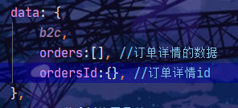
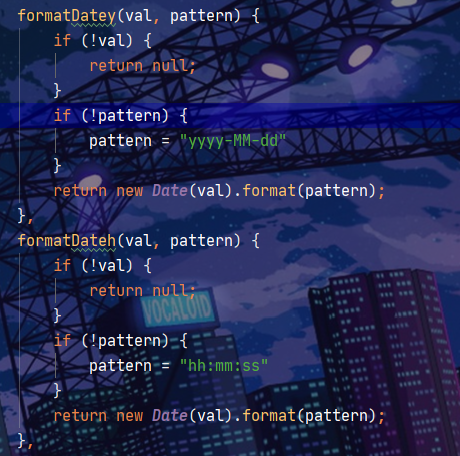
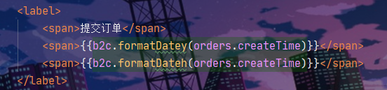
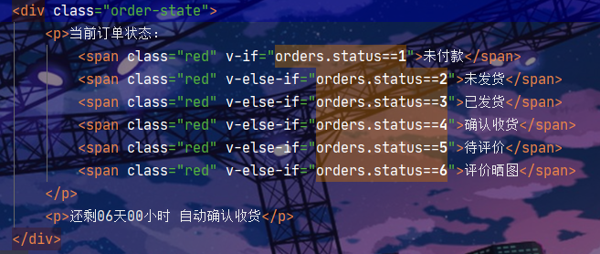
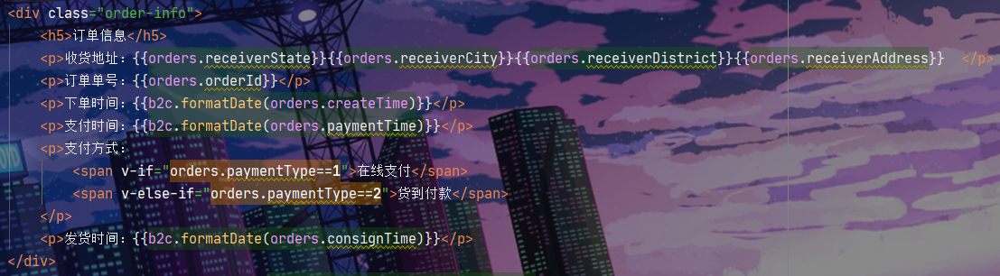
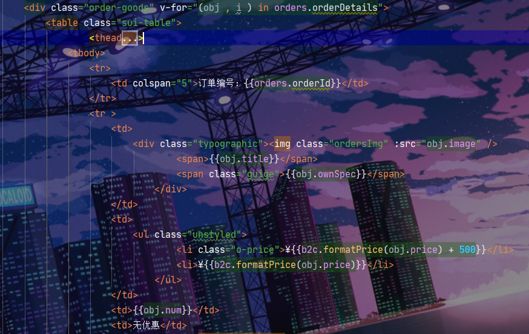
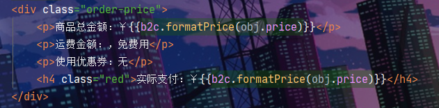
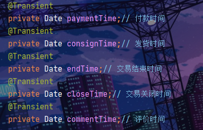
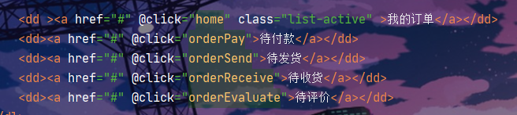
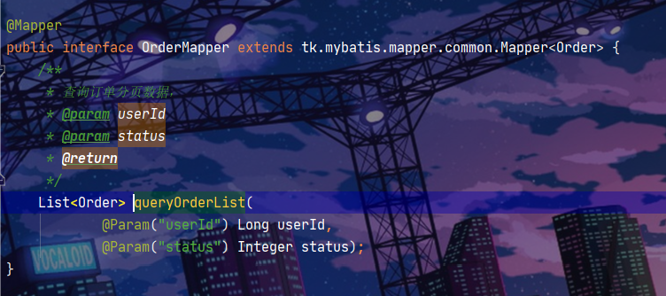

# 								             六组功能实现进度

###  1.订单展示 功能 (完成)


如图所示 进入此页面 要进行 用户登录判定 

无登录 跳转至登录页面 登录 ok 请求后台查询 订单方法 (通过 前台 传递 token解析userId进行 订单查询 ) 并返回 前端 cartList 进行 vue循环展示 

**1.1 订单页面登**

首页的index.html中右上角的我的全品是查看 订单集合 (订单分类查询)


修改用户名并执行logout方法


```
logout() {
    // 删除cookie中的token即可
    Cookies.remove("B2C_TOKEN",{
        path:"/",
        domain:"b2c.com"
    });
    window.location = 'http://www.b2c.com'
},
```

展示用户购买商品数据

```
created() {
    this.getHomeList();
 },
methods: {
    getHomeList(){
        const token = Cookies.get("B2C_TOKEN",,{
        path:"/",
        domain:"b2c.com"
    });
        if (token) {
            // 有token，曾经登录过，查询用户信息
            b2c.http.get("/auth/verify")
                .then(resp => {
                    this.user = resp.data;
                    // 查询订单信息
                    this.loadOrder();
                })
                .catch(() => {
                    // 去登录
                    this.gotoLogin();
                });
        } else {
            // 去登录
            this.gotoLogin();
        }
    },
```

### 展示 后


#### (2).点击 取消订单 **按钮**

发送 删除 订单请求到后台 通过 orderId进行 删除 

​	后端 请求为 "deleteOrder"   接受参数为    orderId  类型 为 Long 

定义一个删除方法


因为要处理订单编号的精度问题，后端要定义一个String 类型的Id


后端定义一个String类型的Id并返回到前端:目的是为了防止 后台数据传递到前台的OrderId精度丢失 导致无法查询 删除


Conreoller

```
/***
 * 取消定单中的数据
 */
@DeleteMapping("deleteOrder/{orderId}")
public ResponseEntity<Void> deleteOrder(
        @PathVariable("orderId") String orderId
){
    try {
        long l = Long.parseLong(orderId);
        this.orderService.deleteOrder(l);
        return ResponseEntity.ok().build();
    } catch (Exception e) {
        e.printStackTrace();
        return ResponseEntity.ok().body(null);
    }
}
```

Service

```
@Transactional
public void deleteOrder(Long orderId) {
    Order order = new Order();
    order.setOrderId(orderId);
    orderMapper.deleteByPrimaryKey(order);

    OrderDetail detail = new OrderDetail();
    detail.setOrderId(orderId);
    detailMapper.delete(detail);

    OrderStatus orderStatus = new OrderStatus();
    orderStatus.setOrderId(orderId);
    statusMapper.delete(orderStatus);
}
```

### (3).点击 立即付款跳转至 支付宝 支付页面 进行 付款 付款完毕更改 status 

​	定义一个支付方法


​	这里要传递 订单Id到支付页面 因为long类型会涉及到精度丢失的问题 所以我们要传递一个 String类型的Id到支付接口 不然会发生精度的丢失 导致 生成订单 跳转支付页面失败等问题.

```
toPay(o){
                window.location.href="http://127.0.0.1:8089/pay/"+o.orderIdStr;//这里的Id是String类型的
},
```


#### （4）订单分页查询

分页数据应该是根据**总页数**、**当前页**、**总条数**等信息来计算得出。

- 当前页：肯定是由页面来决定的，点击按钮会生成不同的页
- 总页数：需要后台传递给我们
- 总条数：需要后台传递给我们

我们首先在data中记录下这几个值：


页面分页条


js函数：


#### 2.点击订单详情跳转至 详情页面 (完成)


同样点击订单详情页面 传递 orderId到后台进行查询 (包含订单的创建时间 订单编号 以及状态)

涉及到多表联查

##### 2.1订单详情页面

###### 2.1.1订单页面传值

点击订单详情将ordersId传给详情页面

注:我的订单,待付款,待发货,待收货,待评价中都需要添加相同的点击事件和方法


```
//订单详情页面传id
orderIds(id){
	window.location.href ="home-orderDetail.html?ordersId="+id;
},
```

###### 2.1.2前端-详情页面接值并查询



在钩子函数中使用b2c中的parse方法将路径?后的键值对截取出来，并取出键值对中的值(ordersId)；

在钩子函数中调用详情页面查询方法，传参ordersId，查询方法返回的数据赋值到orders数组中；

```
created(){//钩子函数
    // 将请求参数转为对象 截取去掉问好，k=v结构转为对象 k:v
    this.ordersId=b2c.parse(location.search.substring(1));
    //调用订单详情页面
    this.detail(this.ordersId.ordersId);
},
methods:{
    //订单详情页面
    detail(id){
        b2c.http.get("/order/getOrder?id="+id)
        .then(resp=>{
            this.orders = resp.data;
        }).catch(()=>{
            alert("查询失败，请稍后重试，或者联系管理员")
        })
    },
},
```

在common.js页面的b2c时间方法处添加两个时间格式



将orders数组中用户名取出放入页面中


将orders数组中的数据放入页面中，调用b2c中方法调整显示效果



根据orders数据判断订单当前状态和订单信息





for循环遍历orders数据





###### 2.1.3后端-详情页面

在orderController类中添加订单编号查询方法

```
@GetMapping("getOrder")
public ResponseEntity<Order> queryOrderById(@RequestParam("id") Long id){
    Order order = this.orderService.queryById(id);
    if (order == null){
        //未找到 404
        return new ResponseEntity<>(HttpStatus.NOT_FOUND);
    }
    return ResponseEntity.ok(order);
}
```

在Order实体类中添加(付款,发货,交易完成,交易关闭,评价)5个时间和他们的set get方法



在orderService类中添加方法查询Order,OrderDetail,OrderStatus的数据并set到order中

将(付款,发货,交易完成,交易关闭,评价)5个时间经过判断set到order中

返回order

```
public Order queryById(Long id) {
    // 查询订单
    Order order = this.orderMapper.selectByPrimaryKey(id);
    // 查询订单详情
    OrderDetail detail = new OrderDetail();
    detail.setOrderId(id);
    List<OrderDetail> details = this.detailMapper.select(detail);
    order.setOrderDetails(details);
    // 查询订单状态
    OrderStatus status = this.statusMapper.selectByPrimaryKey(order.getOrderId());
    order.setStatus(status.getStatus());
    //时间
    if(status.getStatus()==2){  //已付款
        //付款时间
        order.setPaymentTime(status.getPaymentTime());
    }else if(status.getStatus()==3){  //已发货
        //付款时间
        order.setPaymentTime(status.getPaymentTime());
        //发货时间
        order.setConsignTime(status.getConsignTime());
    }else if(status.getStatus()==4){  //已交易完成
        //付款时间
        order.setPaymentTime(status.getPaymentTime());
        //发货时间
        order.setConsignTime(status.getConsignTime());
        //交易完成时间
        order.setEndTime(status.getEndTime());
    }else if(status.getStatus()==5){  //已交易关闭
        //付款时间
        order.setPaymentTime(status.getPaymentTime());
        //发货时间
        order.setConsignTime(status.getConsignTime());
        //交易完成时间
        order.setEndTime(status.getEndTime());
        //交易关闭
        order.setCloseTime(status.getCloseTime());
    }else if(status.getStatus()==6){  //已评价
        //付款时间
        order.setPaymentTime(status.getPaymentTime());
        //发货时间
        order.setConsignTime(status.getConsignTime());
        //交易完成时间
        order.setEndTime(status.getEndTime());
        //交易关闭
        order.setCloseTime(status.getCloseTime());
        //评价
        order.setCommentTime(status.getCommentTime());
    }
    return order;
}
```


#### 3.订单的分类展示(完成)


实现效果点击左侧 订单中心的 导航栏 进行页面的跳转 

然后传递 cookie信息到后台进行查询 此用户订单状态 符合状态的展示到页面 (条件查询)

后端 接口 定义方法 "listTheOrderStuats"  接受参数为 HttpservletRequest request 

返回指定状态的信息到前端进行循环展示 

订单状态: 1、未付款 2、已付款,未发货 3、已发货,未确认 4、交易成功 5、交易关闭 6、已评价',

###### 3.1订单分类展示前台

在前端home.html页面中添加点击事件,触发方法,在方法中设置跳转路径(对应的html页面中)

注:我的订单,待付款,待发货,待收货,待评价中都需要添加点击事件和方法

注:待发货,待收货,待评价中数据和待付款中的一样,个别处有差别



```
//我的订单
            home(){
                window.location.href = "home.html";
            },
            //待付款
            orderPay(){
                window.location.href = "home-order-pay.html";
            },
            //待发货
            orderSend(){
                window.location.href = "home-order-send.html";
            },
            //待收货
            orderReceive(){
                window.location.href = "home-order-receive.html";
            },
            //待评价
            orderEvaluate(){
                window.location.href = "home-order-evaluate.html";
            },
```

在home-order-pay.html页面中加入以下数据

注:status值根据所处状态修改


```
created(){//钩子函数
            //验证用户 登录状态  登录: 查询数据  未登录: 登录
            this.getVeifiyUser();
        },
        methods:{
            getVeifiyUser(){
                const token = Cookies.get("B2C_TOKEN",{
                    path:"/",
                    domain:"b2c.com"
                });
                if (token) {
                    // 有token，曾经登录过，查询用户信息
                    b2c.http.get("/auth/verify")
                        .then(resp => {
                            this.user = resp.data;
                            // 查询订单信息
                            this.loadOrder();
                        })
                        .catch(() => {
                            // 去登录
                            this.gotoLogin();
                        });
                } else {
                    // 去登录
                    this.gotoLogin();
                }
            },
            
            loadOrder(){
                // 查询订单信息
                b2c.http.get("/order/getOrderList?"+ b2c.stringify(this.query))
                    .then(resp => {
                        this.orders = resp.data.items;
                    }).catch(() => this.orders = [])
            },
            //登录
            gotoLogin() {
                window.location = "login.html?returnUrl=" + window.location;
            },
```

获取用户名


通过遍历循环orders来获取数据
    public ResponseEntity<PageResult<Order>> queryUserOrderList(
            @RequestParam(value = "page", defaultValue = "1") Integer page,
            @RequestParam(value = "rows", defaultValue = "5") Integer rows,
            @RequestParam(value = "status", required = false) Integer status,
            HttpServletRequest request) {

        String token= CookieUtils.getCookieValue(request,jwtConfig.getCookieName());
        //获得登陆用户数据
        try {
            UserInfo userInfo = JwtUtils.getInfoFromToken(token, jwtConfig.getPublicKey());
            PageResult<Order> result = this.orderService.queryUserOrderList(page, rows, status,userInfo);
            return ResponseEntity.ok(result);
        }catch (Exception e){
            e.printStackTrace();
            return new ResponseEntity<>(HttpStatus.UNAUTHORIZED);
        }
    }
```

在orderService类中添加方法查询

```
public PageResult<Order> queryUserOrderList(Integer page, Integer rows, Integer status,UserInfo userInfo) {
        try {
            // 设置分页等其起始值，每页条数
            PageHelper.startPage(page, rows);

            // 创建查询条件用户id和状态，由于需要三表联查，sql注解拼接麻烦，所以采用了xml形式
            Page<Order> pageInfo = (Page<Order>) this.orderMapper.queryOrderList(userInfo.getId(), status);

            return new PageResult<>(pageInfo.getTotal(), pageInfo);
        } catch (Exception e) {
            logger.error("查询订单出错", e);
            return null;
        }
    }
```

在orderMapper类中添加查询订单分页数据方法



#### 4.我的收藏


购物车页面 登陆状态下 点击移到我的关注 传递 skuId属性 到  后端 cart服务中去 

​						 接口名"addMyStore"  

​			 			接受参数 Long skuId


service层定义     static final String KEY_PREFIX="b2c:skuId:uid:";

和addCart同理调用 购物车 进行添加skuId属性

导航栏页面点击我的收藏


进入我的 收藏页面 

传递token信息到后台查询  service层 用  b2c:skuId:uid:+userId 到redis中查询出 skuIdList

返 回  skuIdList 

前台进行 判断 !=null 

 skuIdList  到es中循环查询  返回 skuLlist进行 循环展示


#### 5.我的足迹


在search.html页面的图片处加上@click触发方法addHistories  传递 skuId 

addHistories 方法中 将  skuId 保存在 自定义list集合对象中skuIdList  再保存到本地store中


common.js已经提供了set 和get 方法 

点击我的足迹 进行 b2c.store.get("**") store中skuIdList  KEY的 获取  并进行循环去es查询

前台将循环结果展示在页面上

#### 6.会员管理订单项目(待做)

b2c-door项目下js/pages/shortcut.js中我的会员添加@click属性跳转至 users.html<会员购买页面>


点击 支付宝充值页面 将 帐号 内容 和 充值时长 以及status(默认为0此状态vip数据库中有说明)属性传递后台 

后台接受传递的 

​							String username 

​							String opDay 

​							Integer status

查询出 user表中的数据 (这里需要user表中的Id)  通过 保存opTime 并 opDay来判断获得 开通时长 (到期时间ovTime)

并利用雪花算法计算出 vipOrderId

存储到 数据库内 成功则返回  vipOrderId到前台 跳转到支付页面 这里支付接口可以自定义 /修改进行支付 

支付完成进行状态更改在payControoller中修改 调用的接口 (这里推荐写两个支付宝接口防止冲突 ) 


#### 7.购物车页面商品重新购买


##### 一、思路和逻辑分析

1.首先重新购买功能数据由来依据是购物车中删除的商品数据,目的利用用户的纠结心理来提高商品销量的功能(大概).

2.我们点击删除方法的时候不仅仅要进行的是数据的删除,还要将数据重新放到本地/redis中 来方便下方删除商品信息的回显。

3.这里我为什么要说是将数据放到本地/redis因为这涉及到用户登录的问题，用户不登陆状态下依然是可以进行购物车数据的添加和修改的，只不过进行的修改数据在本地而已。

##### 二、具体方法步骤

###### 	（1）.点击删除按钮

​			点击删除按钮调用删除方法，并传递当前商品的sku数据到后端删除方法，删除方法请求完毕后进行此数据的增加（在删除方法完成后） 

###### 	（2）请求方法  

​							为  delDataAdd  （此方法可参考增加购物车数据的方法）

​							cartservice中新增加方法 delDataAdd 

​							传递的数据为sku（前台传递的商品数据）

​							定义新常量 ：b2c:del:uid:

###### 		(3).删除数据增加方法完成后

​					完成后 前端成功回调函数中去进行redis中数据的查询 并返回 前台进行循环展示 。查询成功回调函数中进行刷新页面（重新加载页面数据）。

###### 	（4）用户未登录状态

​		用户未登录状态下的数据删除新增直接在本地localStore中进行添加和删除操作数据就ok。

###### （5）购买


如图点击右侧重新购买按钮，会触发购物车数据增加方法（已经写过了）。将数据重新添加至购物车进行增加，成功回调函数中进行一个数据重新加载/刷新页面。

